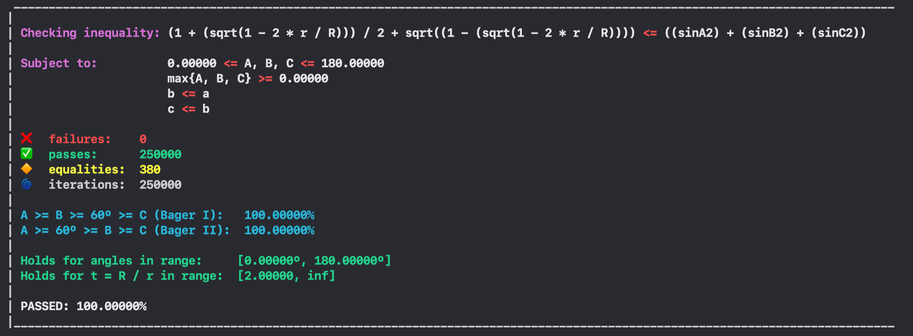

[](https://travis-ci.org/costika1234/triangle-inequality-checker)

# triangle-inequality-checker

# Dependencies

The **triangle-inequality-checker** can be built on UNIX platforms using **g++/clang++** and requires only the [exprtk](https://github.com/ArashPartow/exprtk) submodule to be imported (see **Makefile**).

# How to use?

Build the project via the **make** command and then run it using **./bin/check_triangle_inequality**. The input to the program can be entered in the file **inequality.txt** whose structure is as follows:

* The first non-empty line line which is not a comment (marked by `//`) represents the inequality to be verified by the **triangle-inequality-checker** tool. For convenience, there is support for cyclical sums and products via the commands `[sum <expr>]` and `[prod <expr>]` – e.g. `[sum (b + c)^2] = (b + c)^2 + (c + a)^2 + (a + b)^2`.
* The subsequent lines may specificy additional inequality constraints that will check the original inequality on a restricted space of values. There is also support for  substitutions that can be used to replace certain expressions within the original inequality in order to make typing more convenient and less error-prone. A substitution is defined as an assignment (using the operator `=`) whose left-hand side is made up of **one** of the letters `kmnpquvwxyz` and can optionally be followed by a number (e.g. `x1`, `y23` etc). The right-hand-side of the assignment represents the expression that will be used whenever the substitution is encountered in the original inequality.

# Example Input

Below is an example of how the **inequality.txt** file can look like:

```
// Checking inequality involving cyclical sum.
[sum sinA2] >= x / 2 + sqrt(y)

// Substitutions.
x = 1 + u
y = 1 - u
u = sqrt(1 - 2 * r / R)

// Additional constraints.
a >= b
b >= c
```

# Sample Report

After running the **triangle-inequality-checker** tool on the above input we will obtain the following report:


